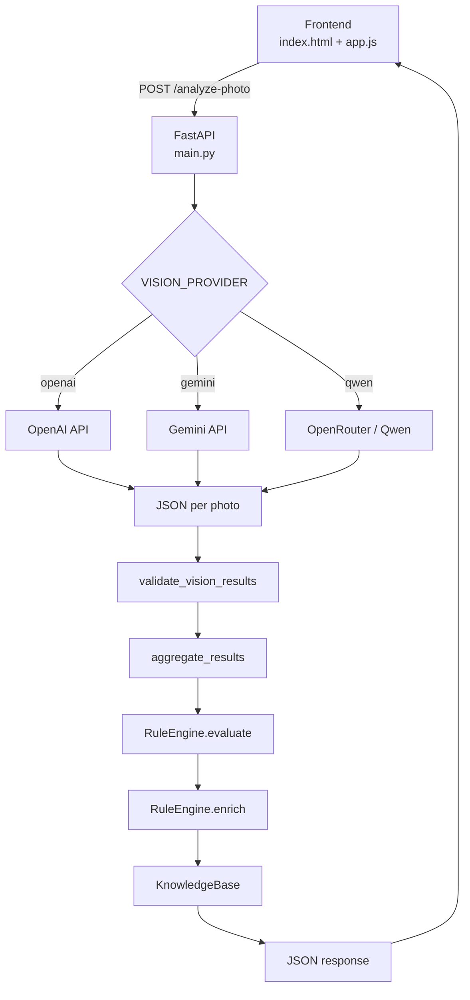

# Архитектура GreenScan

## Общая схема



## Компоненты

### Frontend

- Статический SPA без фреймворков.
- Файлы: `index.html` (корень), `FRONTEND/app.js`, `FRONTEND/styles.css`.
- Загружает 2–5 изображений, отправляет на `http://127.0.0.1:8001/analyze-photo`.
- Отображает состояние газона, уверенность, рекомендации (accordion).
- При ошибке показывает `data.detail` из ответа сервера.

### FastAPI (`BACKEND/main.py`)

- Единственный пользовательский endpoint: `POST /analyze-photo`.
- CORS: `allow_origins=["*"]`.
- Логирование в консоль и `BACKEND/logs/greenscan.log`.
- Автоматически доступны `/docs`, `/redoc`, `/openapi.json` (стандарт FastAPI).

### Vision layer

Выбор провайдера при старте:

```python
provider_name = os.getenv("VISION_PROVIDER", "openai").strip().lower()
```

Допустимые значения: `openai`, `gemini`, `qwen`.

Модули провайдеров импортируются **лениво** — только для выбранного провайдера.

| Провайдер | Файл | Модель |
|-----------|------|--------|
| OpenAI | `main.py` (`_analyze_one_image`) | `OPENAI_VISION_MODEL` (default: `gpt-4o-mini`) |
| Gemini | `vision/gemini_provider.py` | `gemini-flash-latest` (захардкожено) |
| Qwen | `vision/qwen_provider.py` | `QWEN_VISION_MODEL` (default: `qwen/qwen-2.5-vl-7b-instruct:free`) |

**Автоматический fallback между провайдерами не реализован.**

### Shared Vision Prompt (`vision/prompts.py`)

Единый `SYSTEM_PROMPT` для всех провайдеров. Гарантирует одинаковую JSON-схему ответа и правила `is_lawn`.

### Validation (`validate_vision_results`)

Выполняется **до** агрегации и RuleEngine, по каждому фото:

1. `is_lawn` обязателен, тип `bool` → иначе HTTP 422.
2. `is_lawn = false` → HTTP 400 (отклоняется весь набор).
3. `max(confidence) <= 0` → HTTP 422.

Поля `is_lawn` и `lawn_confidence` удаляются из `final_state` перед RuleEngine.

### Aggregation (`aggregate_results`)

| Тип поля | Логика |
|----------|--------|
| `is_lawn` | `all(values)` — все фото должны быть газоном |
| `bool` (остальные) | `any(values)` — признак считается найденным, если есть хотя бы на одном фото |
| `weed_density` | максимум по порядку `low < medium < high` |
| `str` | наиболее частое значение |
| числа и прочее (`confidence`, `lawn_confidence`, `null`) | `values[0]` — значение первого фото |

### RuleEngine (`engine.py`)

**Вход:** `final_state` — словарь агрегированных признаков (без `is_lawn` / `lawn_confidence`).

**Выход:** `list[str]` — ID действий (например `water_increase`, `overseed`).

Этапы:
1. Правила из `knowledge/expert_rules.json` (кроме `apply_herbicide`).
2. Умная логика сорняков по `weed_density`.
3. `mow_lawn` только при `needs_mowing is True`.

### KnowledgeBase (`knowledge.py`)

**Вход:** список action ID + `lawn_state`.

**Выход:** список объектов рекомендаций с опциональными `knowledge_items` (удобрения, гербициды, семена).

Загружает JSON из `BACKEND/knowledge/`:
- `recommendations.json`
- `fertilizers.json`
- `herbicides.json`
- `grass_seeds.json`

`fungicides.json` существует, но **пустой** и **не загружается** кодом.

## Data flow

```text
UploadFile (multipart, field: files)
    → bytes
    → base64
    → Vision API (per photo)
    → JSON string
    → json.loads → parsed dict
    → results[] (список по фото)
    → validate_vision_results(results)
    → aggregate_results(results) → final_state
    → удаление is_lawn, lawn_confidence
    → engine.evaluate(final_state) → actions[]
    → engine.enrich(actions, final_state) → recommendations[]
    → HTTP 200 JSON response
```

Изображения **не сохраняются** на диск. Передаются в Vision API как base64.

## Error flow

| HTTP | Условие | Сообщение (`detail`) |
|------|---------|----------------------|
| 400 | Меньше 2 или больше 5 файлов | «Загрузите от 2 до 5 изображений газона.» |
| 400 | `is_lawn = false` у любого фото | «Одно или несколько загруженных изображений не содержат газон…» |
| 422 | `is_lawn` отсутствует / не bool | «Не удалось достоверно распознать изображение…» |
| 422 | `max(confidence) <= 0` | «Не удалось выполнить достоверный анализ газона…» |
| 422 | Ни один ответ Vision не распарсился | «AI вернул некорректный результат…» |
| 500 | Неизвестный `VISION_PROVIDER` | «Сервис анализа временно недоступен…» |
| 503 | Ошибка Vision-провайдера | «Сервис анализа временно недоступен…» |

Технические детали ошибок провайдера пишутся в лог; API-ключи в логах маскируются.

## Логирование

- Logger: `greenscan`, уровень `INFO`.
- Файл: `BACKEND/logs/greenscan.log` (ротация 5 MB, 3 backup).
- Формат: `endpoint`, `provider`, `model` в каждой записи.

## Health check

Dedicated health endpoint (`/health`) **не реализован**.
